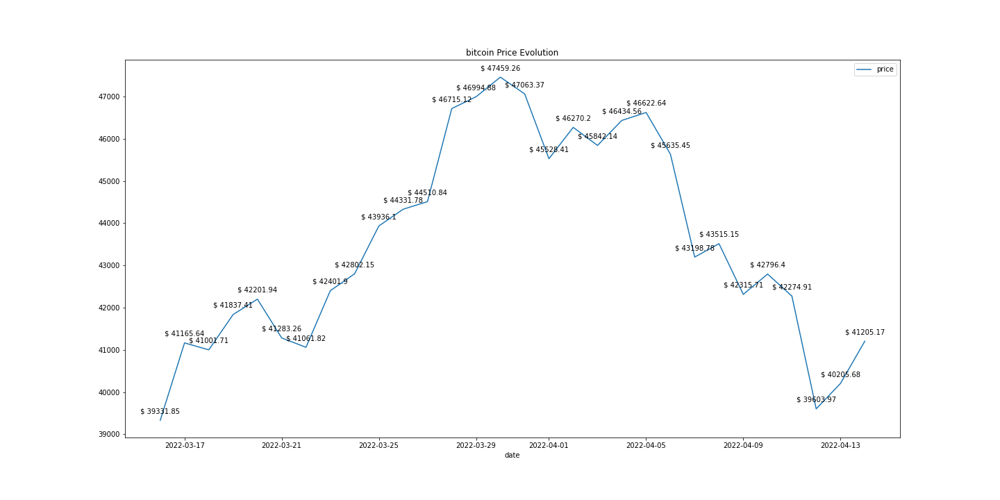
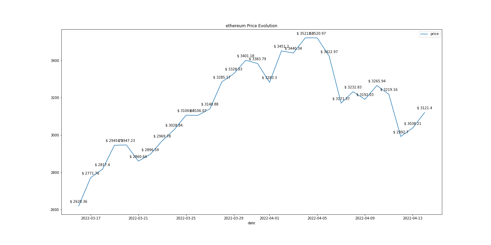
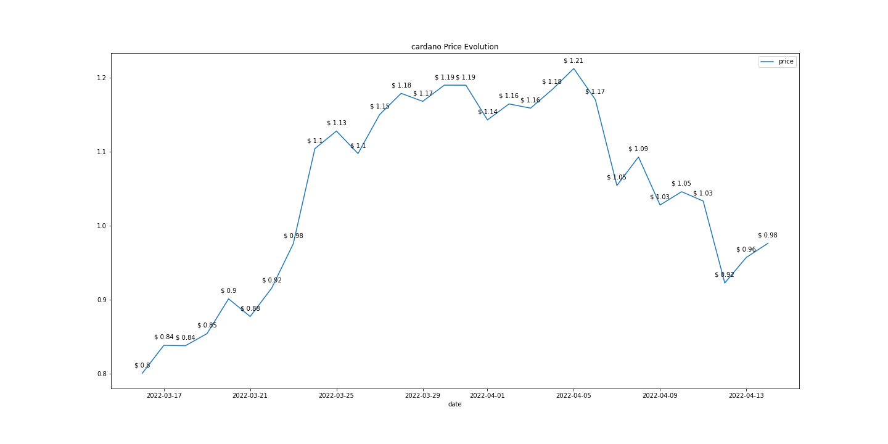
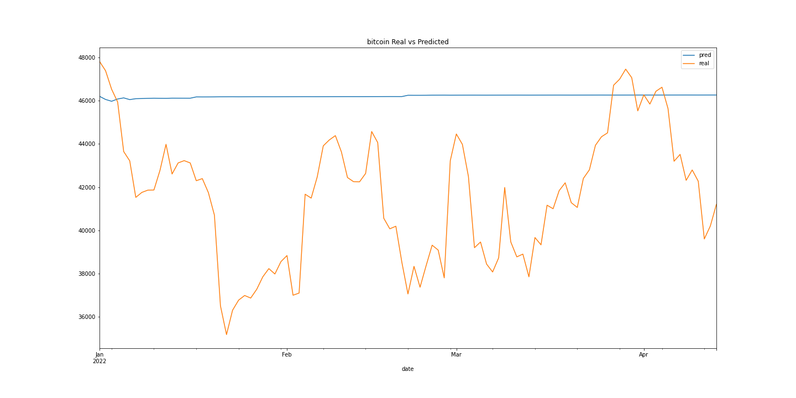
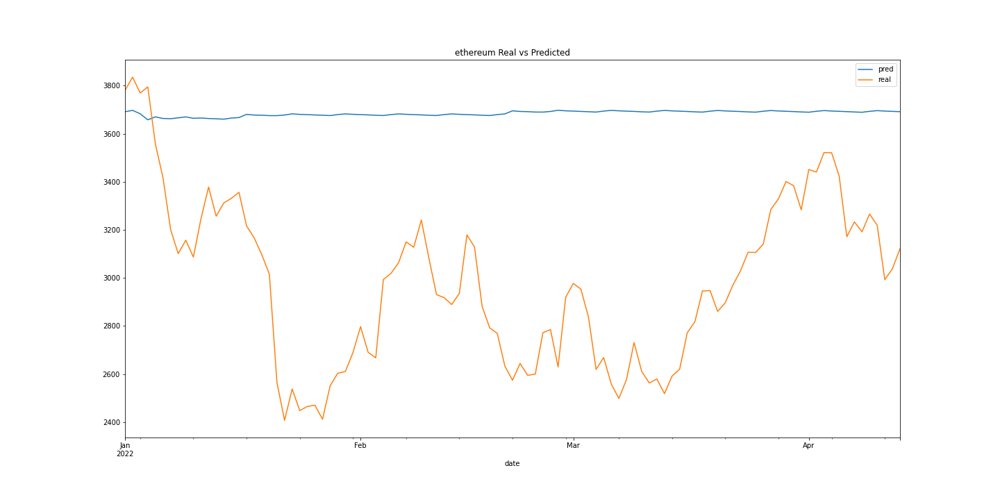
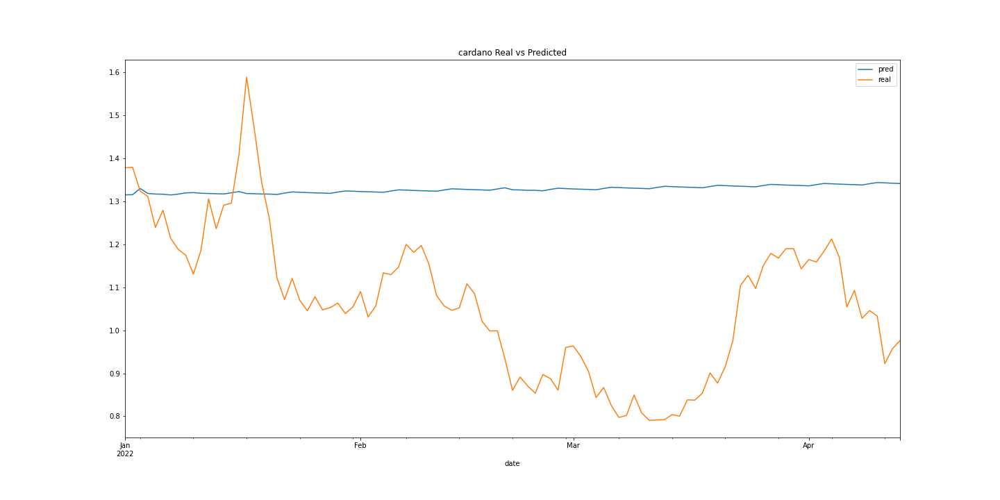

# Mutt Data Exam
[](https://www.python.org/)
[](https://www.postgresql.org/)
[](https://python-poetry.org/)
[](https://python-poetry.org/)
[](https://www.docker.com/)

## Exercise 1

I will instantiate the first project:

```
$ cd exercise_1
$ poetry init
```

After completing the init process, we will have a `pyproject.toml` file defined as follows:
```
[tool.poetry]
name = "exercise_1"
version = "0.1.0"
description = "Exercise 1 from Mutt Data Exam"
authors = ["Luciano Naveiro"]

[tool.poetry.dependencies]
python = "^3.8"

[tool.poetry.dev-dependencies]

[build-system]
requires = ["poetry-core>=1.0.0"]
build-backend = "poetry.core.masonry.api"
``` 

Now we can install our Python app dependencies (and some dev dependencies also), by running the following commands:
```
$ poetry add requests==2.26.0
$ poetry add tqdm==4.60.0
$ poetry add black --dev
$ poetry add isort --dev
$ poetry add pytest --dev
$ poetry add pytest-mock --dev
$ poetry add typing-extensions --dev
```

I'll add some configuration on the `pyproject.toml` file:
```
[tool.black]
line-length = 79
```

Now we can run some commands to clean the code:
```
$ poetry run isort exercise_1
$ poetry run black exercise_1
```

To build this project, I will first crate a network where all the Docker containes will run:

```
$ docker network create mutt-network
```

Now, I 'll build the Docker image:
```
$ docker build -t exercise_1 .
```
This will build the docker image that contains all the code and necessary dependencies. Under the hood, it is installing the poetry app.

To execute the app for a single date and single coin, we should run the following

```
$ docker run --rm --name=container_exercise_1 --network=mutt-network -v=$PWD/exercise_1/output:/app/exercise_1/output exercise_1 "--date=2022-04-20" "--coin=bitcoin"
```

To set up the cron job, I will execute it as a Python script (I didn't find the way to execute the Poetry app inside the crontab tab). So first I install 2 dependencies
```
$ pip3 install -r requirements.txt
```

Now we are all set to create the cron job

```
$ crontab -e
```

it will open a vim editor, and there we input the following command:
```
DATEVAR=date +20%y-%m-%d
* 3 * * * python3 test_exam/exercise_1/exercise_1/main.py --date=$($DATEVAR) --coin=bitcoin
* 3 * * * python3 test_exam/exercise_1/exercise_1/main.py --date=$($DATEVAR) --coin=ethereum
* 3 * * * python3 test_exam/exercise_1/exercise_1/main.py --date=$($DATEVAR) --coin=cardano
```

This will execute everyday at 3 AM and store the data for `bitcoin`, `ethereum` and `cardano`, on `test_exam/exercise_1/exercise_1/output`

For the Point 3, i will assume that each day's data should be stored separatelly, and I added `tqdm` to monitor the progress of the whole bulk reprocess. I added the following parameters to the python app:
- `start_date`: start date of the interval to retrieve data
- `end_date`: date until data wants to be retrieved

## Exercise 2

On this Exercise, I am going to create another Poetry app, extending the previous on:
```
$ cd ../
$ cd exercise_2
$ poetry init
```

After completing the init process, we will have a `pyproject.toml` file defined as follows:
```
[tool.poetry]
name = "exercise_2"
version = "0.1.0"
description = "Exercise 2 from Mutt Data Exam"
authors = ["Luciano Naveiro"]

[tool.poetry.dependencies]
python = "^3.8"

[tool.poetry.dev-dependencies]

[build-system]
requires = ["poetry-core>=1.0.0"]
build-backend = "poetry.core.masonry.api"
``` 

Now we can install our Python app dependencies (and some dev dependencies also), by running the following commands:
```
$ poetry add requests==2.26.0
$ poetry add tqdm==4.60.0
$ poetry add sqlalchemy==1.4.35
$ poetry add psycopg2-binary==2.9.1
$ poetry add pandas==1.2.3
$ poetry add black --dev
$ poetry add isort --dev
$ poetry add typing-extensions --dev
```

I'll add some configuration on the `pyproject.toml` file:
```
[tool.black]
line-length = 79
```

Now we can run some commands to clean the code:
```
$ poetry run isort exercise_2
$ poetry run black exercise_2
```

To set up the PostgreSQL database, I'll use the [official Docker Image](https://hub.docker.com/_/postgres?tab=description)

I have created a `docker-compose.yml` which creates the DB and executes `create_tables.py` script to create the necessary tables:
```
$ cd exercise_2/db
$ docker-compose up
```

The configuration for the DB is the following:
- `username`: `postgres`
- `password`: `postgres`
- `db`: `postgres`
- `host`: `localhost` (or `mutt-db` if executing from inside the created network)
- `port`: `5432`


I added a new Boolean parameter on `main.py` called `store_data_on_db`, in case is `False`, it is just the same as the old `main.py` script. But in case is `True`, data is stored on both tables: `coin_raw` and `coin_aggregated`.
So the logic is as follows:
- for `coin_raw`, it will store on the DB every new combination of `coin_id` and `date`. It will not do anything if the combination `coin_id` and `date` is already on the DB, not even update the value.
- for `coin_aggregated`, it will first delete the record from the month belonging to the selected date, it will compute the max/min values again with the new data, and will store this new value.


Now we can build the Docker image that contains all the code (while on `test-exam/exercise_2` directory):
```
$ docker build -t exercise_2 .
```

To populate the tables from values since 2020-01-01, I execute the following commands:


```
$ docker run --rm --name=container_exercise_2 --network=mutt-network -v=$PWD/exercise_2/output:/app/exercise_2/output exercise_2 "--coin=bitcoin" "--start_date=2020-01-01" "--end_date=2022-04-14" "--store_data_on_db=True"

$ docker run --rm --name=container_exercise_2 --network=mutt-network -v=$PWD/exercise_2/output:/app/exercise_2/output exercise_2 "--coin=ethereum" "--start_date=2020-01-01" "--end_date=2022-04-14" "--store_data_on_db=True"

$ docker run --rm --name=container_exercise_2 --network=mutt-network -v=$PWD/exercise_2/output:/app/exercise_2/output exercise_2 "--coin=cardano" "--start_date=2020-01-01" "--end_date=2022-04-14" "--store_data_on_db=True"
```

## Exercise 3
To solve this Exercise, I created 2 queries using the data from `2022-01-01` to `2022-04-14` from `bitcoin`, `ethereum` and `cardano`. To execute them, I just used DBeaver as an IDE and created the connection to the PostgreSQL DB running on docker, with the following configuration:
- `database`: postgres
- `username`: postgres
- `password`: postgres
- `host`: localhost
- `port`: 5432

So, once connecting to the DB, I execute the following queries

- `exercise_3/avg_monthly_price.sql`: which returns the following:

| coin_id | year_month | avg_price        |
|-----------|--------------|--------------------|
| bitcoin   | 2022-01-01 | 41413.91580726949  |
| bitcoin   | 2022-02-01 | 40648.22165632696  |
| bitcoin   | 2022-03-01 | 41897.67000621025  |
| bitcoin   | 2022-04-01 | 43674.93983449922  |
| cardano   | 2022-01-01 | 1.2269163364346785 |
| cardano   | 2022-02-01 | 1.0315629113580438 |
| cardano   | 2022-03-01 | 0.9337815400992453 |
| cardano   | 2022-04-01 | 1.0818478000646592 |
| ethereum  | 2022-01-01 | 3091.3834038019118 |
| ethereum  | 2022-02-01 | 2863.4249876166464 |
| ethereum  | 2022-03-01 | 2864.979345093724  |
| ethereum  | 2022-04-01 | 3276.7140754157303 |


- `exercise_3/avg_increase_after_drops.sql`: which returns the following:

| coin_id | avg_nominal_increase | avg_percentage_increase | current_market_cap |
|-----------|------------------------|---------------------------|----------------------|
| bitcoin   | 424.8575848682216      | 0.01127334655842378       | 783560801481.9719    |
| cardano   | 0.029080197432107196   | 0.026837297511847897      | 31303049352.34989    |
| ethereum  | 68.87484261145323      | 0.0255933618938961        | 375767680796.0061    |


On this one I assumed that the "the current market cap" is the market cap from the last date I have data.

## Exercise 4

For Exercise 4 I am going to create another Poetry app, and install all the dependencies and Jupyter to use a Notebook. As on the previuous exercises, I initiate teh app by just running the followoing command:

```
$ poetry init
```

After completing the init process, we will have a `pyproject.toml` file defined as follows:

```
[tool.poetry]
name = "exercise_2"
version = "0.1.0"
description = "Exercise 2 from Mutt Data Exam"
authors = ["Luciano Naveiro"]

[tool.poetry.dependencies]
python = "^3.8"

[tool.poetry.dev-dependencies]

[build-system]
requires = ["poetry-core>=1.0.0"]
build-backend = "poetry.core.masonry.api"
``` 

Now we can install our Python app dependencies (and some dev dependencies also), by running the following commands:

```
$ poetry add sqlalchemy==1.4.35
$ poetry add psycopg2-binary==2.9.1
$ poetry add pandas==1.2.3
$ poetry add jupyter==1.0.0
$ poetry add matplotlib==3.4.1
$ poetry add holidays==0.13
$ poetry add scikit-learn==0.24.2
```

Now we can build the Docker image, and launch a Jupyter Notebook from inside the container and expose it on `localhost:8888`:

```
$ docker build -t exercise_4 .
$ docker run --rm --name=container_exercise_4 --network=mutt-network -v=$PWD/exercise_4:/app/exercise_4 -p 8888:8888 exercise_4
```

On this exercise, we can plot the last 30 days point prices of each of the coins, resulting on the following plots





To create the forecast, I am going to use dates from `2020-01-01` to `2021-12-31` as training data, and try to forecast the values from `2022-01-01` to `2022-04-14` and compare them with the real values.

To solve this time series analysis, I am going to use a simple `LinearRegression` from `sklearn`, and just using the price features, and the weekend and holiday ones. As I am using the previuos 7 prices as an input to the model, I will use a recursive multi step forecasting strategy (when forecasting I have to use the result from the previous predictions).

After running the model for each of the three models, we can conlcude that this simple linear model is not even close of catching the breaking points and the different trends, as we can see on the following plots




